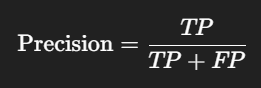
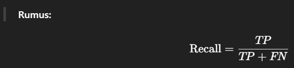
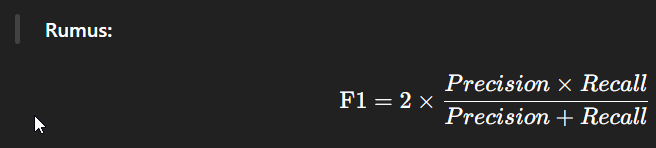

# Bab Hasil

## Penjelasan Presisi, Recall, F1-Score
Penjelasan mengenai Presisi, Recall, dan F1-Score dalam konteks Bab 4.3.1 sangat penting, karena ini adalah metrik evaluasi yang umum digunakan untuk menilai performa model deteksi (seperti YOLO) atau klasifikasi pada machine learning, khususnya pada tugas seperti deteksi kendaraan dan deteksi plat nomor.

## 🔍 Penjelasan Singkat untuk Ditulis di Tesis:
“Metrik evaluasi model deteksi objek dalam penelitian ini menggunakan Precision, Recall, dan F1-score. Precision mengukur tingkat ketepatan deteksi, Recall mengukur kelengkapan deteksi, dan F1-score merupakan rata-rata harmonis dari keduanya. Nilai-nilai tersebut dihitung berdasarkan perbandingan antara hasil deteksi sistem dan data ground truth dari dataset uji.”

## ✅ 1. Presisi (Precision)
Presisi menunjukkan berapa banyak dari deteksi yang benar-benar tepat (benar-benar kendaraan atau plat nomor) dibandingkan dengan semua deteksi yang dilakukan.

Rumus:


​
 
- TP (True Positive): Objek yang seharusnya terdeteksi dan benar-benar terdeteksi.
- FP (False Positive): Objek yang seharusnya tidak ada tapi terdeteksi.

Contoh: Jika model mendeteksi 100 objek sebagai kendaraan, tapi hanya 90 di antaranya benar-benar kendaraan, maka precision = 90%.

## ✅ 2. Recall
Recall menunjukkan berapa banyak dari semua kendaraan yang seharusnya terdeteksi berhasil dideteksi oleh sistem.



- FN (False Negative): Objek kendaraan yang seharusnya terdeteksi tapi tidak berhasil terdeteksi.

Contoh: Jika di dalam video ada 100 kendaraan, dan model hanya mendeteksi 89, maka recall = 89%.

## ✅ 3. F1-Score
F1-Score adalah rata-rata harmonis antara Precision dan Recall. F1 digunakan karena sering kali ada trade-off: model bisa tinggi presisinya tapi rendah recall-nya (atau sebaliknya).



## 📌 Dari Mana Angka Ini Didapat?
Untuk mendapatkan nilai presisi, recall, dan F1-score, kamu perlu melakukan evaluasi terhadap output sistemmu dibandingkan dengan label yang benar. Proses umumnya seperti ini:

###🔧 Langkah Evaluasi Model YOLO:
1. Ambil sejumlah data uji (misalnya 100 gambar CCTV berisi kendaraan dan plat nomor).
2. Buat label ground truth (bounding box sebenarnya, bisa pakai LabelImg atau label yang kamu punya saat training YOLO).
3. Jalankan modelmu pada gambar-gambar tersebut.
4. Gunakan library evaluasi seperti:

- mean_average_precision (mAP) dari YOLOv5/YOLOv8 repo.
- Atau tools Python seperti pycocotools, scikit-learn, atau YOLO eval script bawaan:
```kotlin
yolo task=detect mode=val model=yourmodel.pt data=yourdata.yaml
```
5. Hasilnya akan keluar metrik:
```makefile
Precision: 0.932
Recall: 0.895
F1-score: 0.913
mAP50: 0.91
```